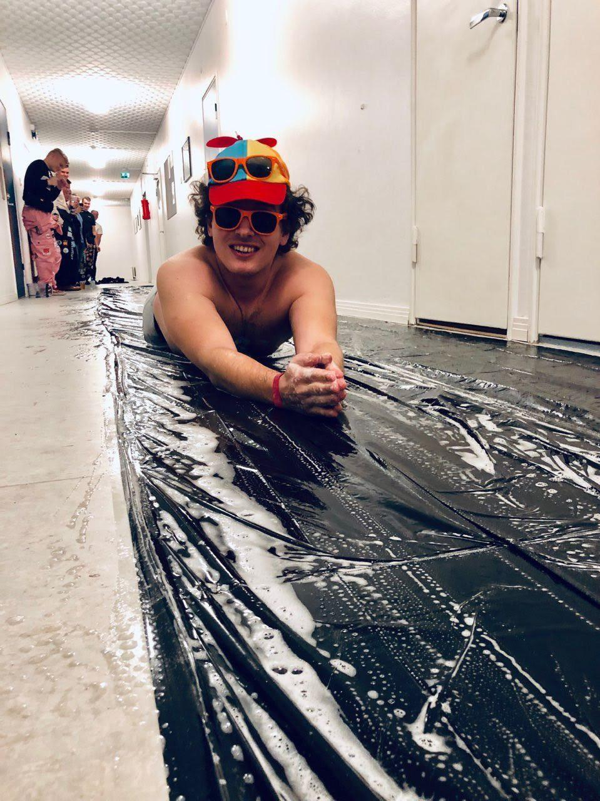
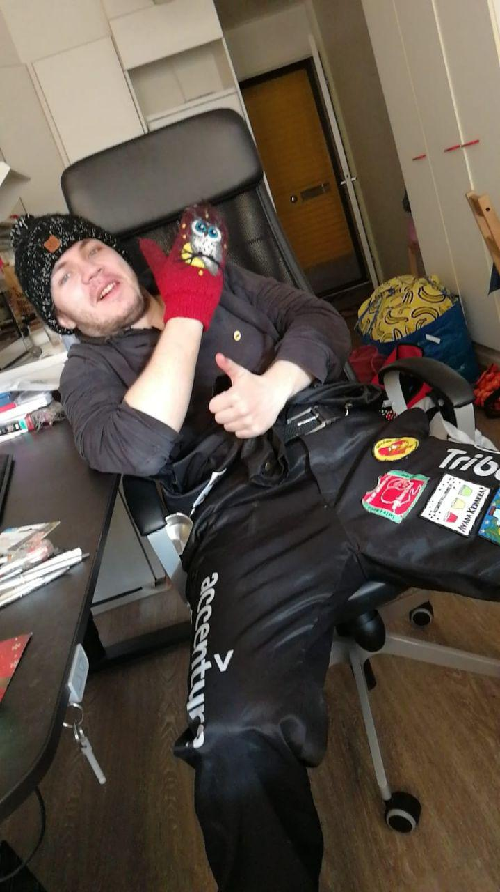
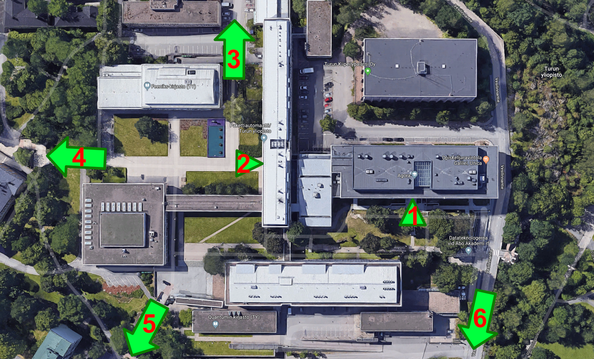
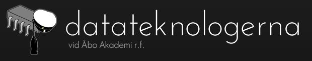

## Välkommen
Vi vill som tutorer för datateknik gratuera dig til din studieplats!
På den här sidan hittar du lite information om studierna samt en
 introduktion till oss tutorer. Så länge du deltar aktivt under de 
 första veckorna så hittar du bra in i studievardagen!

Som tutorer kommer vi att hjälpa er hitta fram under studieorienteringsveckan 
(första veckan), och introducera er till andra studeranden och
 föräningar. Det kommer mycket ny information under den första
  veckan, men det är bara att fråga sådant som man glömmer.
  
Här hittas nyttig information för nya datateknik studeranden: https://Date.abo.fi/gulis <<<-------

## Tutorer

### Benna
Halloj, jag heter Benjamin och börjar nu på mitt fjärde 
år här på Datateknik. Jag kommer från den finare sidan av 
Finland alltså Österbotten eller mer specifikt Jakobstad.
Det här blir mitt andra år som tutor
så om ni har frågor kan ni nå mig vid Bfinell@abo.fi 

### Jonas
Hej hallå, jag heter Jonas men kallas ofta för Fellman och ska
 börja på mitt andra studieår här på Datateknik. Jag kommer från
  den sköna skärgårdsplatsen Åland och skall fungera som en av 
 era tutorer detta år. 
Har ni några frågor eller funderingar hjälper jag gärna,
 ni når mig via mejlen (jofellma@abo.fi)
 /whatsapp 0404877326 eller via facebook.
 

### William

1. Agora ingång 
2. Natura ingång
3. Axelia & resten av ÅA campus
4. Kyrkan
5. Tavastgatan
6. Assarin (bra mat)

Vid det här området kommer du som datateknik studerande
 att spendera mest tid. Vill du bekanta dig mera med 
 campusområdet kan du hitta mera information här under
  "Maps": https://Date.abo.fi/gulis

I Agora kommer ni under första året ha en grundkurs i 
programmeringsspråket Python samt två kurser i Java,
 utöver programmeringen kommer ni få lära er grundläggande
strukturer i Datavetenskap och hur man bygger upp ett
 projekt för att lyckas, flera intressanta kurser följer.

Utöver de informationstillfällen som ÅA ordnar kommer 
vi tillsammans med andra ämnen att ha kvällsaktiviteter,
 för att ni skall lättare hitta er in i gänget. 
 Speciellt kemiteknik/kemi och datavetenskap studeranden kommer ni att se mycket av.

Ämnesföreningen DaTe ordnar evenemang under hela året.
 Vi är med och ordnar intressanta föreläsningar och chill kvällar
  i bland annat vårt kansli, spelkvällar tillsammans med 
  våra vänföreningar samt fester/sitzar kan också förekomma.
   Via DaTe får ni också den svarta halaren som bärs med stålthet på diverse evenemang. 
På https://DaTe.abo.fi hittas mera information om ämnesföräningen!

Vi har också en facebook grupp tillsammans med kemi och kemiteknik gulisar 
som ni får gå med i: //TODO
Där kommer det att komma information om diverse evenemang samt annan viktig information.
DaTe

